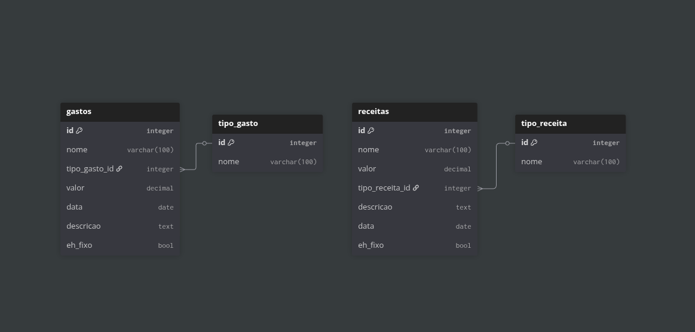

# Sistema de Gestão Financeira

Pequeno projeto pessoal para implementar conceitos e técnicas de programação 
com API, banco dados e integração com front-end. A ideia é ser um projeto simples e melhorar ele com o passar do tempo.

## Tecnologias Utilizadas
### Backend
- **FastAPI** (*Framework para a API*)
- **PostgreSQL** (*Banco de Dados*)
- **Docker** (*Containarização e Princípio da Imutabilidade*)
- **Python** *(Linguagem de programação)*

### Frontend
- **JavaScript** (*Linguagem de Programação*)
- **HTML5** (*Linguagem de marcação*)
- **CSS3** (*Linguagem de marcação*)

## Diagrama do Banco de Dados

**Link**: https://dbdiagram.io/d/gerenciamento-financeiro-68fb1955357668b73268ab49



## Como rodar o projeto

### Clonar Projeto
```git clone https://github.com/FellipeAlmeida/Sistema-de-Gest-o-Financeira```

### Ativar o ambiente virtual
```
# Crie o ambiente virtual
python -m venv venv

# Ative o ambiente virtual
source venv/bin/activate
```

### Entrar no diretório do Back-end
```cd backend```

### Comando Docker
```docker compose up -d --build```

